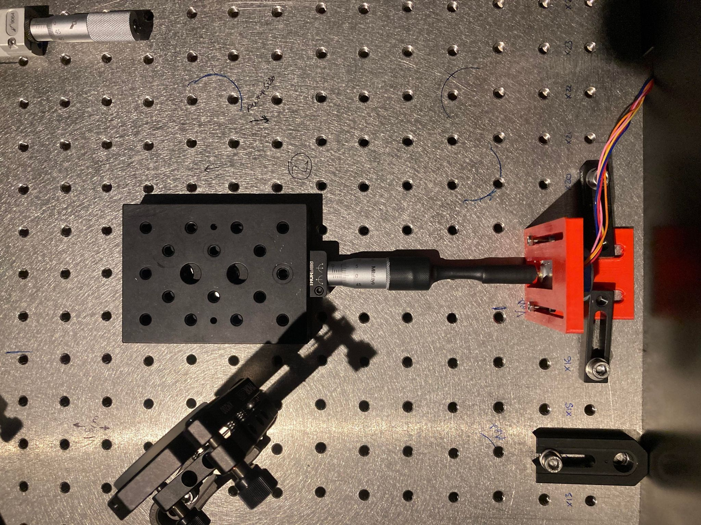
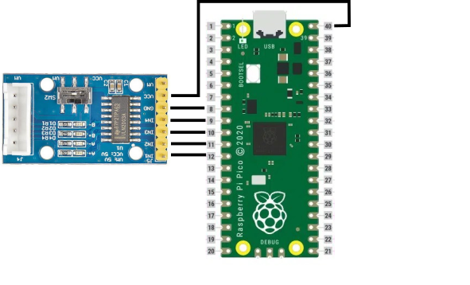
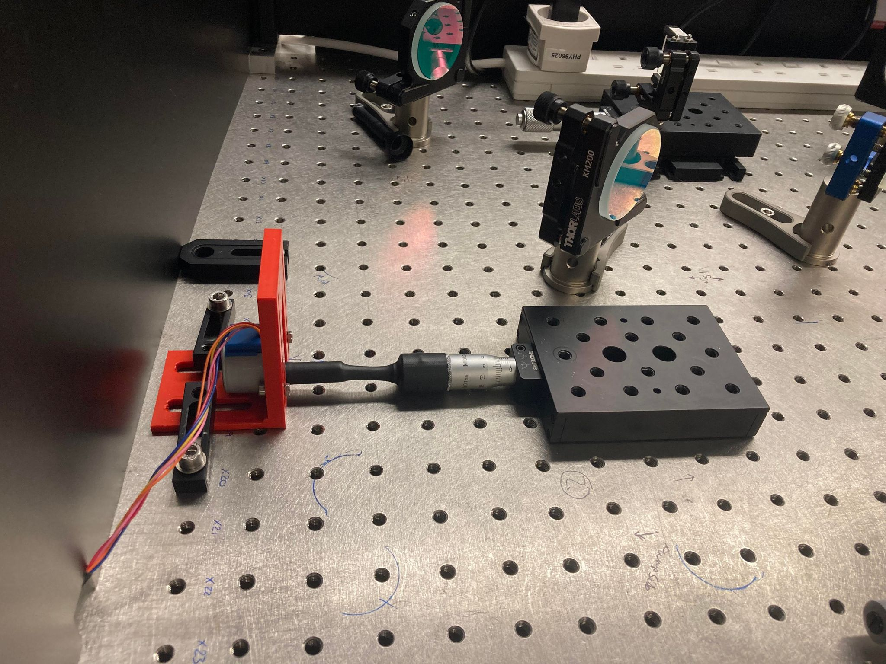
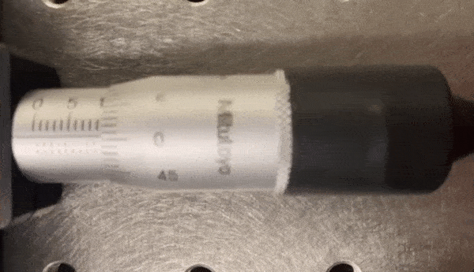

# Manual-to-Motorized-Linear-Translation-Stage-Upgrade-Kit, using the 28BYJ-48 stepper motor and a heat shrink flexure.
The cheapest possible design for upgrading a manual linear translation stage to an automatic one, whilst retaining the original precision of the device. 

>>>The files for the design are available here but the project tutorial is currently a work in Progress.

## Intro

This guide should walk you through the conversion of a manual linear translation stage to an automatic one, with a material cost on the order of ~$20. This is very economial considering the typical price of a motorised translation stage is around $1000, 4x that of the manual one.

It can also serve as a tutorial on how to remotely control a 28BYJ-48 stepper motor over wifi, via a website hosted on a Pi Pico W. This is likely a more general use case. If this is what you would like to do, then simply skip the Connecting Flexure section of this guide.

By the time you have finished this guide you should have something vaguely resembling this final product.
### The Final Product



## BILL OF MATERIALS
  ```
  Raspberry Pi Pico W
  28BYJ-48 stepper motor, 1/16th reduction (or equivalent)
  A suitable stepper motor driver board (this guide references the driver board in this pack: https://thepihut.com/products/stepper-motor-driver-pack)
  A suitable plastic project box (metal cannot be used as it will block wifi connectivity)
  USB A to Micro USB 2.0 cable
  20 mm diameter heat shrink
  ```
  
## Mounting Components and Electrical Connections


  
## Programing the Pico

This project is designed to work with micropython so first set the pico up for that. A good guide for this is available here: https://www.raspberrypi.com/documentation/microcontrollers/micropython.html.

The networking aspect of this device is based off tinyweb (https://github.com/belyalov/tinyweb), so ensure that the tinyweb folder and logging.py file are uploaded the Pi Pico before uploading the boot.py script. This can be done using a Pico compatable IDE like Thonny (https://thonny.org/).

boot.py contains options for changing the SSID and password of the network access point, change those to suit. There are also options for changing settings for how quickly the speed of the stepper motor ramps up and down when it starts and stops. Adjusting these can be helpful if you find the intertia of your motor's load is causing missed steps, leading to inaccuracies in positioning.

## Connecting the Flexure



## Device Operation


