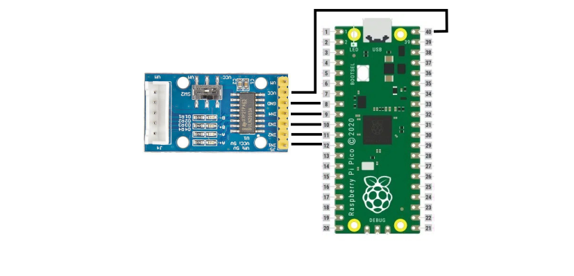
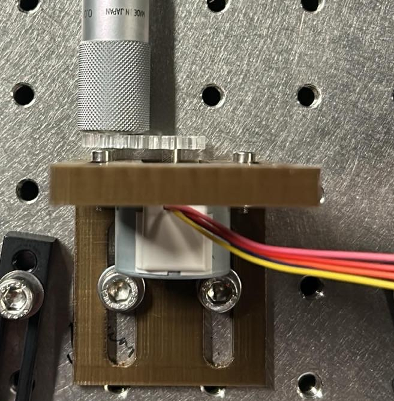

# Manual-to-Motorized-Linear-Translation-Stage-Upgrade-Kit, using the 28BYJ-48 stepper motor and a heat shrink flexure.
The cheapest possible design for upgrading a manual linear translation stage to an automatic one, whilst retaining the original precision of the device. 

## Intro

This guide should walk you through the conversion of a manual linear translation stage to an automatic one, with a material cost on the order of ~$20. This is very economial considering the typical price of a motorised translation stage is around $1000, 4x that of the manual one.

It can also serve as a tutorial on how to remotely control a ramped 28BYJ-48 stepper motor over wifi, via a website hosted on a Pi Pico W. This is likely a more general use case. If this is what you would like to do, then simply skip the Mouinting Components and Connecting the Flexure section of this guide.

By the time you have finished this guide you should have something vaguely resembling this final product.
### The Final Product


## BILL OF MATERIALS
  ```
  Raspberry Pi Pico W
  28BYJ-48 stepper motor, 1/16th reduction (or equivalent)
  A suitable stepper motor driver board (this guide references the driver board in this pack: https://thepihut.com/products/stepper-motor-driver-pack)
  A suitable plastic project box (metal cannot be used as it will block wifi connectivity)
  USB A to Micro USB 2.0 cable
  20 mm diameter heat shrink
  ```
  
## Electrical Connections

Connect the Pico to the driver board like so. This can be done with solder or jumper wires. I recommend soldering for a more rugged connection.



After this, mount the boards in your project box, making sure to cut holes to allow the usb cable to plug into the Pico and the stepper motor cable to plug into the driver board. You could mount the components with screws but, considering how cheap they are, hot gluing them directly into the project box works just as well.

When powering the device in situ, the usb can be plugged into either a plug to USB transformer or a computer USB port; both should be more than capable of providing the current needed to power the stepper.
  
## Programing the Pico

This project is designed to work with micropython so first set the pico up for that. A good guide for this is available here: https://www.raspberrypi.com/documentation/microcontrollers/micropython.html.

The networking aspect of this device is based off tinyweb (https://github.com/belyalov/tinyweb), so ensure that the tinyweb folder and logging.py file are uploaded the Pi Pico before uploading the boot.py script. This can be done using a Pico compatable IDE like Thonny (https://thonny.org/).

boot.py contains options for changing the SSID and password of the network access point, change those to suit. There are also options for changing settings for how quickly the speed of the stepper motor ramps up and down when it starts and stops. Adjusting these can be helpful if you find the intertia of your motor's load is causing missed steps, leading to inaccuracies in positioning.

## Mounting Components and Connecting the Flexure

If you have chosen to print one of the provided L-brackets, the motor can be mounted to them at an adjustable height using M4 sized bolts. The bracket itself can then be mounted to a table or platform with M6 bolts. 

After, one of the padded linkages should be attatched to the brass protusion from the motor. Which size you will need will vary depending on your printer and settings so I suggest printing all of them and trying each to find which one has the snuggest fit. The ideal case is a linkage that will only go on when hammered lightly with a soft mallet, as it is the least likely to move. 

Next, stretch the heatshrink over both the linkage and the micrometer of the translation stage. Then heat with a heat gun or soldering iron. Make sure to hold the motor and micrometer level as it sets and take care not to melt the 3D printed parts.

The heatshrink is suprisingly ridgid in the rotational direction and has no problem transmitting force to the micrometer, whilst being flexible in the x-y plane. As a result, the axis of rotation of the motor and micrometer can be displaced up to ~5mm, as shown below, without any negative effects.

### The Flexure Connection


### Alternative Connection: Gears
Alternatively, the motor and micrometer can be connected using push fit gears. An easy way to fabricate these would be to laser cut them from acrylic sheet. If you would like to do this, the design files for said gears are provided in the design folder. The slot in the motor mounted gear is deliberately undersized so it can be filed to a close push fit and the inner diameter of the micrometer gear should be adjusted for the specific micrometer you see using.



## Device Operation

After powering the pico, the device should automatically produce it's own wireles access point that can be connected to with a phone or computer in the usual way. After this, open any web browser and enter 192.168.4.1. This will take you to a form that will allow you to control the motor remotely.

This process can be automated by connecting to 192.168.4.1?steps=N, where N is the number of steps (+ve or -ve) you wish to progress. This can be done in python using the urllib library.

### A gif demonstrating the precision of the system (going from 0.5 to 0.5 on the micrometer).


This reliability is sustainable over many rotations. In A recent test the micrometer was rotated 20 times forward then 20 back repeatedly for a total of 800 rotations whilst maintaining a stop position at 0.5 the entire time. 

## Variants of The System
Three variants of this system have already been produce and the code to run them is available in the Varient-code file. A brief explanation/tutorial on both of them is available below.
### Multiple Motors

### Many Wirelessly Networked Motors
This variant uses all the same files as before but a new boot.py script as found in the networked-motor driver. It connects to the first device's wifi using the same wifi name and password. Then it can be controlled wirelessly by an additional device by entering the ip address of the new device into a web browser.

### Step Tracking Stopping Over-Extending of Micrometer
This code allows for the current position of the micrometer to be stored in a textfile and read and updated while making sure that it does not go out of bounds. When first setting this up, it is important to enter the correct position on the tracking textfile, converting position to steps. This takes just a single number as shown in the example tracking.txt. For the 25mm micrometer, it has been set so that the 0 point is at 0.5mm (one rotation from 0mm) and the maximum is at 24.5mm which corresponds to 24576 steps. These bounds can be changed. Additionally, moving the motor clockwise (when attached by heat shrink or similar) reduces the amount on the micrometer so the f_step function minuses steps and therefore has the lower bound rather than upper. Therefore b_step is opposite to this.

Care needs to be taken when instead using gears and moving the motor clockwise moves the micrometer anti-clockwise so f_step and b_step do the opposite. In order to rectify this, you can either swap them so f_step is now minus or swap the bounds around and the + and - in new_pos.
